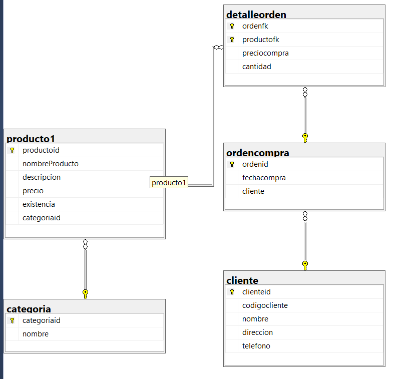

# Ejercicio de creacion de base de datos con SQL-LDD

```SQL
-- Creation of the database tienda1

-- Create the database tienda1
create database tienda1;

-- SQL LDD
-- Utilizar una base de datos
use tienda1;

-- truncate table categoria; Delete tables with data
-- drop table categoria; Delete newborn tables without data

-- Create Category
create table categoria(
categoriaid int not null,
nombre varchar(20) not null,
constraint pk_categoria -- Magic word to do restrictions (Constraint)
primary key(categoriaid),
constraint unico_nombre unique(nombre)
);

-- SQL-LMD
-- Add registers to the table "Categoria"
insert into categoria
values(1, 'Carnes Frias');

insert into categoria(categoriaid, nombre)
values(2, 'Linea Blanca');

insert into categoria(nombre, categoriaid)
values('Vinos y Licores', 3);

insert into categoria
values (4, 'Ropa'),
		(5, 'Dulces'),
		(6, 'Lacteos');

insert into categoria(nombre, categoriaid)
values ('Panaderia', 7),
	('Zapateria', 8),
	('Jugueteria', 9);

-- select * from categoria where categoriaid = 4; One specific selection

-- Products table


create table producto1(
	productoid int not null,
	nombreProducto varchar(20) not null,
	descripcion varchar(80) null,
	precio money not null,
	existencia int not null,
	categoriaid int null,
	constraint pk_producto1
	primary key (productoid),
	constraint unico_descripcion
	unique(nombreProducto),
	constraint chk_precio
	check (precio > 0.0 and precio <= 1000),
	constraint chk_existencia
	check(existencia>0 and existencia<=200),
	constraint fk_categoria_producto1
	foreign key (categoriaid)
	references categoria(categoriaid)
	);


	select * from categoria
	select * from producto1

	insert into producto1
	values (1,'Miguelito','Dulce sano para la lombriz',34.5,45,5);

	insert into producto1
	values (2,'Tupsie Pop','Paleta sabrosa pal diente',1000,200,5);

	insert into producto1
	values (3,'Plancha','Plancha facil para el suit',256.3,134,2);

	select * from producto1
	where categoriaid=5;

	create table cliente(
	clienteid int not null identity (1,1),
	codigocliente varchar(15) not null,
	nombre varchar(30) not null,
	direccion varchar(100) not null,
	telefono varchar(19),
	constraint pk_cliente
	primary key(clienteid),
	constraint unico_codigocliente
	unique (codigocliente)
	);

	create table detalleorden (
	ordenfk int not null,
	productofk int not null,
	preciocompra money not null,
	cantidad int not null,
	constraint pk_detallorden
	primary key (ordenfk,productofk),
	constraint chk_preciocompra
	check (preciocompra>0.0 and preciocompra <= 20000),
	constraint chk_cantidad
	check (cantidad>0),
	constraint fk_detalleorden_producto
	foreign key (productofk)
	references producto1(productoid)
	);


	create table ordencompra(
	ordenid int not null identity(1,1),
	fechacompra date not null,
	cliente int not null,
	constraint pk_ordencompra
	primary key (ordenid),
	constraint fk_ordencompra_cliente
	foreign key (cliente)
	references cliente(clienteid)
	);

	alter table detalleorden
	add constraint fk_detalleorden_ordencompra
	foreign key (ordenfk)
	references ordencompra(ordenid);
```

